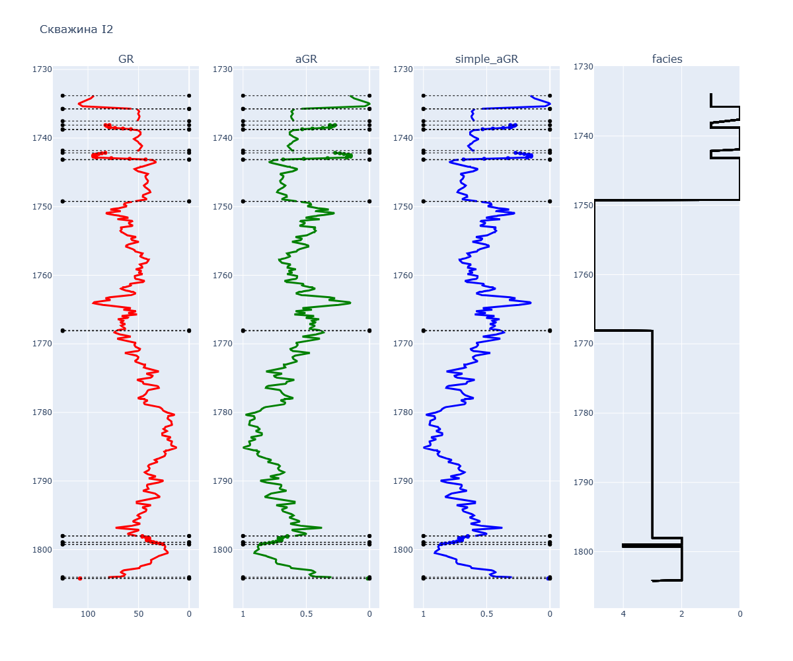
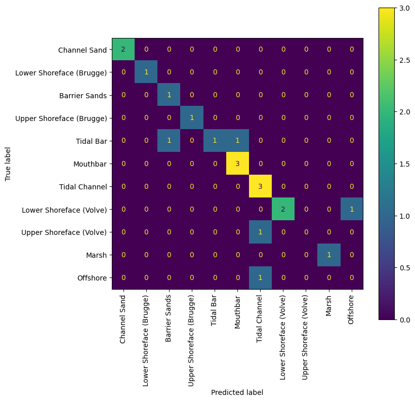

# Facies-prediction-from-well-log-data
Предсказание фациальных обстановок по данным геофизических исследований скважин

## Пример визуализации каротажа в скважине и кода фациальной обстановки по интервалам

## Confusion Matrix на тестовых скважинах после обучения модели бустинга

